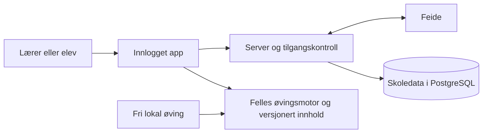

# Feide, digitale lekser og lærerens fremgangsoversikt

Plan v1.1, 28. september 2026. Planleggingssak: `spansk-ungdomsskole-kbzy`. Personvernmodell følges i `spansk-ungdomsskole-brq`. [Implementeringsoppdraget til GPT-6 Luna](2026-09-28_luna-implementeringsoppdrag-feide.md) presiserer utlogging, sikkerhetsverifikasjon og dokumentasjon til Sikt/kommunene. Ingen implementasjon er utført som del av disse planene.

## 1. Produktbeslutning og målgruppe

Spansk på 1-2-3 er for **hele ungdomsskolen og spansk nivå I i videregående**. Læreren velger innhold etter tema og forkunnskaper. Dagens A0–A1-merking beskriver innholdet som finnes, ikke hele målgruppen eller en bekreftet dekning av læreplanen. Videre utvikling skal kartlegges mot relevante mål i [læreplanens nivå I](https://www.udir.no/lk20/fsp01-04/kompetansemaal-og-vurdering/kv965).

**Den nye hovedflyten:** Læreren logger inn med Feide, velger klasse og øvingsinnhold, setter frist og publiserer leksen. Elevene logger inn, finner leksen og øver. Læreren ser gjennomføring og faglig fremgang i ordforråd, grammatikk, verbbøying og lytting.

Produkteierens erfaring er at mange lærere bruker mye tid på å skrive ut og håndtere lekser. Dette er produktets sentrale nyttehypotese: enklere tildeling, mindre utdeling/innsamling og bedre grunnlag for oppfølging. Faktisk tidsbesparelse må måles i pilot, uten å love et bestemt antall sparte minutter på forhånd.

**Feide og lærerflyten er besluttet produktretning.** Arbeidet er ikke betinget av at et visst antall kunder først etterspør Feide. Produkteieren har allerede tilgang til å registrere tjenester via Sikt. Det som gjenstår, er konfigurasjon, integrasjon, applikasjonens funksjoner og skoleeiers aktivering/godkjenning.

Denne leveransen er en implementasjonsplan og et konkret forslag til data-/personvernmodell. Den registrerer ingen tjeneste og oppretter ingen kontoer eller skylagring. Valg av driftsleverandør og skoleeiers vurderinger er egne, konkrete leveranser før bruk med ekte elevdata.

## 2. Dagens grunnlag og manglene vi må fylle

| Finnes i prosjektet | Bruk i ny løsning / nødvendig tillegg |
|---|---|
| Statisk app i `index.html`, lokal fremgang og GitHub Pages-oppsett. | Behold øvingsmotoren; legg til sikker server, database og lærer-/elevvisninger. Statisk hosting alene kan ikke håndheve tilgang til elevdata. |
| `buildTeacherAssignmentPackage()` og formatet `assignment-v1`. | Gjenbruk valg av gloser, verbfokus og grammatikk. Erstatt filutdeling med serverlagrede, versjonerte lekser i kontomodusen. |
| `practiceHistory` med økt-/lekse-ID og `learningProgress` med ord-/ferdighetsstatus. | Gjenbruk relevante begreper og stabile ID-er. Definer en egen minimert serverkontrakt; ikke last opp hele localStorage. |
| Én lokal aktiv leksepakke. | Servermodusen trenger flere samtidige lekser og entydig kobling mellom oppgave, elev og riktig lekseversjon. |
| Lytteoppgaver har svar/resultat i minnet, uten lagret progresjon. | Lag egen hendelseskontrakt og faglig merking for lytting. Dagens app kan ikke allerede levere en historisk lytteoversikt. |
| Diktat lagrer bare historie og dato for alle deler forsøkt. | Hold aktivitet og riktige svar atskilt; diktat er en egen underkategori, ikke bevis for all lyttekompetanse. |
| Eksport/import av lokal fremgang. | Behold bakoverkompatibiliteten. Ny konto skal ikke automatisk tilordnes alt arbeid på en delt enhet. |

Kodegrunnlag: `normalizeAssignmentPackage`, `buildTeacherAssignmentPackage`, `beginPracticeSession`, `recordPracticeSession`, `normalizeLearningProgress`, `submitListeningStoryAnswer` og `renderListeningStoryCompletion` i [index.html](../../../index.html). Personvern og nåværende begrensninger står i [README](../../../README.md).

## 3. Første komplette produktleveranse

Første lærerpilot skal ha hele kjeden **innlogging → klasse → lekse → elevøving → læreroversikt**, med de fire fagområdene. Vi kan utvikle og demonstrere ordforråd først, men den betalte leveransen beskrevet her er ikke ferdig før også grammatikk, verbbøying og lytting virker.

**Lærer:** Opprett eller velg klasse → velg fagområde og tema/ordsett/historie → sett et kort mål og frist → forhåndsvis → publiser. En tidligere lekse kan kopieres. Første versjon tildeler til en hel klasse; individuelle tilpasninger kommer senere hvis pilotene krever det.

**Elev:** Logg inn → se «Mine lekser» med frist og status → åpne en lekse → besvar oppgavene → se hva som er gjennomført og om resultatet er lagret. Fri øving er fortsatt tilgjengelig, men bare arbeid startet fra leksen teller som denne leksen.

**Læreroversikt:** Klasse og periode, deretter kolonner for ordforråd, grammatikk, verb og lytting. Åpne én elev for temaer, oppgavegrunnlag og utvikling. Vis «Ikke startet», «Påbegynt», «Gjennomført» og «Ingen nye data» uten å likestille manglende data med svak kompetanse. Ingen rangering av elever.

**Avgrensning:** Ingen karakterbok, foreldreinnlogging, meldinger, elevfritekstinnlevering, taleopptak, AI-vurdering eller kobling til skolens læringsplattform i første versjon. All lyd er eksisterende, faglig kontrollert produktlyd. Ingen tekst-til-tale.

## 4. Arkitektur som bevarer dagens app

Foreslått teknologi er en liten TypeScript/Node-server og PostgreSQL med administrert drift i EU/EØS. Dette er et arkitekturforslag, ikke et valgt leverandørkjøp. Velg driftsleverandør i fase A ut fra databehandleravtale, faktisk datalokasjon, underleverandører/supporttilgang, sikkerhetskopier, logging, kostnad og gjenoppretting. En EU-region alene er ikke tilstrekkelig beslutningsgrunnlag.

Foreslått adresse for kontoløsningen er `app.spansk123.no`, med frontend og API på samme origin. Offentlig side/fri lokal øving kan fortsatt ligge på `www.spansk123.no`. Kontroller DNS-tilgang før registrering av endelige redirect-URI-er. Underdomener og tjenesten er ikke opprettet.

Gjenbruk kataloger, fasit og øvingslogikk. Legg et lite lag rundt lagring og leksekontekst, og skill lærergrensesnitt fra elevøving. Gjør bare nødvendige uttrekk fra enkeltfilen, med regresjonstester før uttrekk. Behold standardfasitens eksisterende kilde og stabile ID-er.

Lag et eget innlogget appskall med strammere innholdssikkerhet og en service worker som bare cacher eksplisitt offentlig innhold. Personlige sider, API-responser, innlogging, callback og lærerdata skal ha `Cache-Control: no-store` og skal aldri havne i offentlig/offline cache. Første kontoversjon krever nett for innlogging og lagring; lokal fri øving fungerer fortsatt uten konto. Ikke lov en fullstendig offline lærerplattform.

## 5. Konkret Feide-oppsett med eksisterende Sikt-tilgang

1. Bruk eksisterende tilgang til Feide kundeportal. Bekreft riktig leverandørorganisasjon og at produkteieren kan registrere den aktuelle tjenesten. Opprett separate applikasjoner for test og produksjon, med separate hemmeligheter og redirect-/logout-adresser.
2. Registrer tjenestens navn, kontakt, personvernbeskrivelse og aktuelle skoleeiere. Bruk testbrukere og syntetiske skoler først. Begrens aktiveringstilgang til pilotskolene ved produksjonsprøve.
3. Bruk OpenID Connect Authorization Code Flow med PKCE. Serveren håndterer callback og tokenutveksling. Client secret og tokens skal ikke eksponeres til appens JavaScript, git, nettleserlagring eller logger. Den standardiserte utloggingsforespørselens nødvendige `id_token_hint` til Feide er et avgrenset protokollunntak; håndtering og vern mot logging er beskrevet i Luna-oppdraget.
4. Den lokale førsteversjonen ber om `openid userinfo-name`. Feide-dokumentasjonen beskriver `sub` fra OpenID og navn gjennom `userinfo-name`/UserInfo; det eksakte mottaket verifiseres mot Feide-testkonto før produksjon. Første versjon henter ikke gruppe-, e-post-, telefon-, fødselsdato- eller fødselsnummerdata. Intern skole-/klasserolle tildeles gjennom godkjent lokal medlemskapsprosess og engangsinvitasjon, ikke antatt fra navn eller e-postdomene. Hvis skoleeier trenger verifisert org-attributt for invitasjon, må dette velges og testes som en eksplisitt utvidelse før ekte elevtilgang.
5. Valider signatur med roterbare nøkler, issuer, audience, utløp, nonce, state og PKCE. Bruk et vedlikeholdt OIDC-bibliotek, eksakte tillatte redirect-adresser og servervaliderte returlenker. Lag korte, tilbakekallbare serverøkter med Secure/HttpOnly/SameSite-cookie, CSRF-beskyttelse og rotasjon etter innlogging.
6. Foreslått lokal øktgrense: åtte timer absolutt, 30 minutters inaktivitet for lærer. Fornyet innlogging kreves etter utløp; ikke bruk `longterm` eller langvarige refresh-tokens i første versjon. Utlogging tilbakekaller først appøkten og bruker deretter Feides RP-Initiated Logout med registrert returadresse og kontrollert state. Ved nettfeil vises lokal utlogging som gjennomført og Feide-utlogging som ubekreftet. Feides OIDC-mekanisme logger ikke automatisk ut andre Feide-applikasjoner; ikke lov global SLO. Test delte maskiner, flere faner, bakoverknapp og gamle API-svar. Se [Feides logout-beskrivelse](https://docs.feide.no/reference/oauth_oidc/logout.html) og [registrering/parametere](https://docs.feide.no/service_providers/manage/openid_connect/redir_etter_logout.html).
7. Skoleeier må aktivere tjenesten for egne brukere. Registrering hos Sikt gjør ikke løsningen automatisk tilgjengelig for alle skoler. Før pilot dokumenteres både aktivering og skolens faglige/personvernmessige godkjenning.

Dette følger Feides anbefaling om authorization code, begrensede attributter og sikker tokenhåndtering. [OIDC-sikkerhet](https://docs.feide.no/service_providers/openid_connect/security.html), [tokenflyt](https://docs.feide.no/service_providers/openid_connect/feide_obtaining_tokens.html), [applikasjonsoppsett](https://docs.feide.no/service_providers/manage/openid_connect/managing_applications.html), [aktivering hos skoleeier](https://docs.feide.no/service_providers/manage/access_to_services/activation.html).

**Identitet over tid:** Bruk intern UUID og en separat binding til verifisert issuer/subject og skoleeier. Ikke bruk navn, e-post eller elevens lokale kode som kontonøkkel. Feide dokumenterer at også `sub` kan gjenbrukes dersom en Feide-konto gjenbrukes. Verifiser derfor før elevdata at skoleeier tilbyr en egnet ikke-gjenbrukbar identifikator, eller en dokumentert og håndhevet livssyklus som hindrer gjenbruk mens gamle bindinger/data finnes. Manglende løsning på dette blokkerer produksjon hos den skoleeieren. Automatisk gjenåpning av avsluttede kontoer og sammenslåing ved navnelikhet er forbudt. [Feides identifikatorer](https://docs.feide.no/reference/schema/identifiers/index.html).

## 6. Roller, skoler og klassemedlemskap

Skoleeier er øverste dataområde, med egne skoler under. Alle skole-, klasse-, lekse- og resultatposter tilhører riktig skoleeier og skole. Alle API-kall kontrollerer aktive rettigheter på serveren, også eksport, summer og søk. UUID-er eller skjulte knapper gir ingen tilgangsbeskyttelse i seg selv.

| Rolle | Tilgang |
|---|---|
| Elev | Egne tildelte lekser og egne resultater. Ingen andre elevers navn, medlemskap eller resultater. |
| Lærer | Bare klasser vedkommende er godkjent ansvarlig/medlærer for og resultatene som er knyttet til disse klassene. |
| Skoleadministrator | Administrer skolens lærertilgang og klasseansvar. Ingen standardtilgang til alle elevresultater; pedagogisk tilgang krever egen begrunnet rolle. |
| Leverandør/support | Ingen generell lærerinnboks eller elevoversikt. Tidsbegrenset, dokumentert og logget supporttilgang når skoleeier ber om nødvendig bistand. |

Feide-ansattrolle er nødvendig der den brukes, men gir ikke automatisk lærer- eller administratorrettighet. Første skoleadministrator godkjennes av skoleeiers autoriserte kontakt utenfor selvregistreringsflyten. Skoleadministrator godkjenner lærere og klasseansvar. En lærer kan ikke velge en annen skole eller gi seg selv mer tilgang.

**Minste klasseflyt:** Godkjent lærer oppretter klasse. Elevene logger inn og bruker en utløpende invitasjon til å be om medlemskap. Verifisert skoletilhørighet må stemme; lærer godkjenner forespørselen. Invitasjonskoden alene gir ingen tilgang til klassen eller data. Koden kan roteres, har forsøkstak og viser ikke elevliste. Ukjent/skiftende skole eller tvetydig rolle gir ingen dataadgang før administrativ avklaring.

Undersøk Feides gruppeinformasjon i fase A for begge skoleslag. Hvis relevante undervisningsgrupper og nødvendige rettigheter faktisk finnes, kan de gjøre tilknytningen enklere senere. Ikke legg full automatisk klasseimport på kritisk vei i første pilot. [Feides Groups API](https://docs.feide.no/reference/apis/groups_api/index.html).

**Fjerning og bytte:** Skoleadministrator kan straks sperre konto, lærerrolle eller medlemskap, og alle eksisterende økter mister denne tilgangen ved neste API-kall. Feide-attributter kontrolleres ved hver ny innlogging; dette er ikke en garanti om løpende beskjed fra Feide. Skoleeier må ha en avtalt rutine for å varsle/slå av avsluttede tilganger. Klassemedlemskap har skoleårsavgrensning og må fornyes ved nytt skoleår. Ved bytte av skoleeier opprettes et separat dataområde; ingen automatisk overføring av læreres tilgang eller elevhistorikk.

## 7. Datamodell og leksenes livsløp

| Data | Nødvendig innhold og formål |
|---|---|
| Skoleeier/skole | Intern ID, organisasjonsreferanse, aktiv avtale/godkjenning. Skiller tilgang og behandlingsansvar. |
| Identitetsbinding | Intern bruker-ID, godkjent Feide-binding, nødvendig visningsnavn, livsløpsstatus og skoletilknytning. Oppbevares adskilt fra læringshendelser. |
| Klasse og medlemskap | Skoleår, klassebetegnelse, ansvarlige lærere, elev-ID-er, start/slutt og status. |
| Lekse og versjon | Lærer, klasse, tittel, kort instruks, frist/tidssone, fagområde, innholdsreferanser og fullføringsregel. Publisert versjon er uforanderlig. |
| Tildeling | Elev-ID, lekseversjon, tildelingsdato og status. Lag et øyeblikksbilde av mottakere når leksen publiseres. |
| Økt og oppgaveutfall | Pseudonym elev-ID, tildeling, serveropprettet økt-ID og oppgaveinstans, monotont forsøksnummer per instans, unik hendelses-ID, oppgave-/innholdsversjon, ferdighetsreferanse, forsøkt/riktig/feil/hint og serverens mottakstid. Ingen rå elevtekst eller lyd. |
| Oppsummering | Avledede resultater per elev, tildeling og fagområde med tellere og datogrunnlag. Kan gjenbygges fra hendelser innen lagringstiden. |
| Administrasjonslogg | Endringer i roller, medlemskap, publisering, eksport, sletting og nødvendig supporttilgang. Ingen oppgavesvar eller tokens. |

Databasen håndhever sammenhenger med nøkler som inkluderer skoleeier/skole. En lærers klient kan aldri bestemme hvem som eier et resultat. Serveren henter bruker-ID og rettigheter fra den aktive økten. Bruk databasepolicyer som ekstra vern der det er egnet; automatiserte tester må likevel verifisere hvert API.

En lekse går fra utkast til publisert og deretter avsluttet/arkivert. Å endre publisert innhold oppretter en ny versjon og en eksplisitt ny tildeling; eksisterende resultater flyttes ikke. Frist kan endres med synlig endringshistorikk. Sent arbeid vises som mottatt etter frist; fristpassering skal ikke slette elevens arbeid.

Nye elever får ikke automatisk all gammel klassehistorikk eller alle gamle lekser. Læreren velger hvilke aktive lekser den nye eleven skal få. Når eleven fjernes fra klassen, stanser ny tildeling og tilgangen til klassearbeidet; tidligere resultater følger den avtalte lagrings-/innsynsregelen hos skoleeier, ikke gammel lærertilgang uten videre.

Første versjon bruker antall besvarte oppgaver/deler som fullføringsregel. Tidsmål kan vises som veiledning, men en åpen fane beviser ikke arbeid. Feil svar teller som et forsøk, ikke som riktig; rettingsforsøk må vises separat slik at én oppgave ikke blåser opp antallet.

## 8. Fremgang i fire fagområder

| Område | Lærerens oversikt | Arbeid før levering |
|---|---|---|
| Ordforråd | Ordsett, retning, antall ulike ord forsøkt og utfall. | Bruk stabile ord-ID-er. Vis selvvurderte gloser som selvvurdering, atskilt fra sjekkede svar. |
| Grammatikk | Tema/ferdighet, antall besvarte, første svar og senere forsøk. | Koble oppgavene til versjonerte tema-/ferdighets-ID-er. |
| Verbbøying | Verbgruppe, tid og variasjon i verb/personformer. | Gjenbruk bøyningskatalog; ikke utled helhetlig språkmestring fra få gjentatte former. |
| Lytteforståelse | Historie og spørsmål, besvarte/riktige, tidspunkt og tilgjengelig oppgavegrunnlag. | Nye stabile spørsmål-ID-er og registrering fra lytteflyten; avspilling alene teller ikke som forståelse. |

Lærerens områdeoversikt beregnes av hendelser fra vedkommendes autoriserte klasser/tildelinger. Fri privat øving på kontoen deles ikke automatisk med læreren. Eleven kan se en samlet egen oversikt; læreroversikten forklarer at den viser tildelt arbeid. Dermed kan eleven ha øvd mer enn læreren ser.

Vis antall og periode sammen med prosent, for eksempel «6 av 8 første svar riktige i denne økten». Første svar betyr forsøksnummer 1 per serveropprettet oppgaveinstans i én økt. Serveren håndhever unik kombinasjon av økt, instans og forsøksnummer. Forsøk som ankommer i omvendt rekkefølge settes sammen etter forsøksnummer; et manglende første forsøk gir ufullstendig grunnlag, ikke et konstruert første svar. Klientens klokke avgjør ikke rekkefølgen. Flere økter vises separat; leksens samlede gjennomføring teller ulike obligatoriske oppgavereferanser som er forsøkt, mens resultatet viser valgt økt og antall økter. Gjentatt øving skal ikke blåse opp antall fullførte lekseoppgaver.

Ingen data skal vises som null prosent. «Fremgang» betyr utvikling i de aktuelle øvingsoppgavene; ikke karakter, full kompetansevurdering eller automatisk diagnostisering. Ved feil innhold/fasit merkes berørte historiske oppgaveutfall som usikre eller ugyldige, med forklaring og ny innholdsversjon. De utelates fra resultatprosenten, mens faktisk utført arbeid beholdes, og eleven kan få et nytt forsøk. Gamle fritekstsvar kan ikke vurderes på nytt når råsvaret ikke lagres. Første versjon lover derfor ikke omberegning av slike svar og utvider ikke datainnsamlingen for å gjøre dette mulig. Eventuell omberegning begrenses til tilfeller der lagrede strukturerte data er tilstrekkelige og endringen kan forklares.

Oppgavefasit og innhold finnes allerede i klienten. Resultater er derfor formative øvingsdata som kan manipuleres på elevens enhet, ikke bevis for kontrollert vurdering. Valider hendelsesformat, tildeling og gyldige oppgavereferanser på serveren; ikke presenter dette som en jukssikker prøveplattform.

## 9. Lagring, nettbrudd og delte enheter

Serveren er autoritativ for tildelinger og kvitterte kontoresultater. Leksens innholdsversjon og unike hendelses-ID gjør gjentatt innsending idempotent. Samtidige økter fra to enheter skal bevare begge forsøk, uten å overskrive hele fremgangsobjekter med «siste lagring vinner».

I første kontoversjon beholdes ventende hendelser bare i minnet under et kort nettbrudd. Vis «Ikke lagret ennå», og prøv samme hendelse igjen når forbindelsen kommer tilbake. En serverkvittering kreves før «Lagret» eller «Gjennomført» vises til eleven/læreren. Ved varig nettbrudd stopper nye leksesvar, og eleven får tydelig forklaring. Før omlasting/utlogging varsles det om ukvitterte svar; de kan gå tapt ved lukking. Dette er en bevisst første avgrensning, ikke støtte for lekser uten nett. Fri lokal øving og eksisterende lokal eksport/import fortsetter separat.

Ved utløpt innlogging pauses øvingen, personlige visninger skjules og ventende svar holdes i øvingsfanens minne. Eleven velger «Logg inn igjen», som åpner et separat, brukerutløst vindu for Feide. Hovedfanen navigeres ikke bort. Callback-vinduet melder bare at innloggingen er avsluttet; ingen tokens eller elevdata sendes gjennom vindusmeldingen. Kontroller meldingsorigin og vindureferanse, og hent deretter en fersk serverbekreftelse av intern bruker, skole og økt før køen sendes. Serveren knytter oppgaveøkten til opprinnelig bruker og avviser innsending fra en annen konto.

Hvis vinduet blokkeres/lukkes, beholdes køen og en tydelig knapp lar eleven prøve igjen. Ingen automatisk redirect av hovedfanen. Dersom eleven velger å forlate fanen, varsles det konkret at ukvitterte svar kan gå tapt. Hvis en annen konto logger inn, skal køen ikke sendes, gamle personlige visninger forblir skjult, og appen tilbyr gjeninnlogging på opprinnelig konto eller eksplisitt forkasting før kontobytte. Avbryt gamle forespørsler og forkast svar som tilhører forrige brukerkontekst. Utlogging fjerner personlige visninger, minne, kontocacher og øktsesjon; lokal fri øving slettes ikke uten at brukeren velger det. Lærerdata lagres ikke i service worker eller localStorage.

## 10. Data- og personvernmodell før produksjon

**Formål:** Tildele lekser, lagre gjennomføring, gi eleven egen fremgang og gi ansvarlig lærer et avgrenset oppfølgingsgrunnlag. Ingen reklameprofiler, salgsanalyse av elever eller sekundær bruk til modelltrening.

Skoleeier fastsetter behandlingsgrunnlag, nødvendighet, informasjon til elever/foresatte, innsyn, lagringstid og risikovurdering. Leverandøren behandler skoledata på dokumentert instruks og inngår databehandleravtale. Ikke bruk et klikk fra eleven eller en enkelt lærer som erstatning for denne prosessen. Skoleeier vurderer behovet for DPIA før pilot med persondata. [Udirs veiledning om skoleeiers ansvar](https://www.udir.no/regelverk-og-tilsyn/personvern-for-barnehage-og-skole/barnehage--og-skoleeiers-ansvar/).

**Dataminimering:** Visningsnavn er nødvendig for at autorisert lærer skal følge opp riktig elev; navn er fortsatt persondata selv om hendelser bruker UUID. Ingen fødselsnummer, fødselsdato, elev-e-post, mikrofonopptak, skjermopptak, rå elevsvar, elevforklaringer eller hele lokale eksportfiler samles inn. Lærerens korte lekseinstruks lagres, med beskjed om å unngå personopplysninger. Lokal elevtilbakemelding forblir lokal og er utenfor synkroniseringen.

**Forslag til lagringstid som må fastsettes i avtalen:**

| Data | Foreslått regel |
|---|---|
| Lekser, tildelinger og læringsutfall | Aktivt skoleår og maksimalt 90 dager etter avslutning. Pilotavtaler får egen sluttdato og samme eksport-/slettemulighet. |
| Identitet og medlemskap | Så lenge skoleforholdet og nødvendig oppbevaring gjelder. Tilgang stanses straks ved avslutning; bindinger sperres mot utilsiktet gjenbruk. |
| Sikkerhets-/tilgangslogger | 30 dager som utgangspunkt; særskilt hendelsesbevaring må begrunnes og avgrenses. IP-adresser regnes som persondata; minimer og begrens dem. |
| Sikkerhetskopier | Rullerende, krypterte kopier med maksimalt 30 dagers omløp. Ingen uendelig arkivkopi. |
| Avsluttet skoleavtale | Eksportvindu og slettedato avtales; forslag er sletting fra aktive systemer senest 30 dager etter avtalt slutt, tidligere når skoleeier instruerer. |

Ved overlapp gjelder tidligste avtalte slettedato med mindre et konkret, dokumentert oppbevaringsbehov gjelder. Slettejobber dekker avledede oversikter, identitetsbindinger, hendelser og eksportfiler. En minimal gjenopprettingsjournal bevares separat fra databasesnapshot og inneholder nødvendig sletting, sperring og tilbakekalling av roller, klasse-/skolemedlemskap og skoletilganger; den skal ikke beholde læringshistorikk. Ved restore gjennomføres journalen til et dokumentert konsistent punkt, og alle gjenopprettede appøkter ugyldiggjøres før tjenesten åpnes. Manglende journal eller ubekreftet fullstendighet holder kontodelen stengt. Bevis også at en fortsatt aktiv lærer med fjernet klasseansvar ikke får tilbake tilgangen, og at en gammel cookie avvises. Detaljert kontrakt og tester står i Luna-oppdraget.

**Innsyn og eksport:** Eleven kan se egne data. Skoleeier kan håndtere forespørsler og eksportere sine skoledata. Lærer får bare nødvendig eksport for egne aktive klasser. Eksport inneholder bare autoriserte elever, bruker kortvarig tilgang og logges. Filer skal ikke sendes som vedlegg av systemet eller legges på offentlig URL.

**Drift:** Navngitt driftsansvarlig, kryptert transport og database/backuper, hemmelighetshåndtering, begrenset produksjonstilgang, oppdateringsrutine, varsling om hendelser og dokumentert restore. Foreslått pilotmål: høyst 24 timers tap ved katastrofe og gjenoppretting innen én arbeidsdag; verdiene må testes og aksepteres, ikke presenteres som lovet tjenestenivå før det finnes kapasitet.

Før ekte data: ferdigstill leverandør-/underleverandørliste, datalokasjoner og tilgang fra andre land, konkret kostnad, avtaler, tilgjengelighetsvurdering og elevinformasjon for både skoletyper. Ikke skriv «GDPR-godkjent» eller «Feide-godkjent» som generell kvalitetsgaranti.

## 11. Overgang fra lokal øving og kontoens livsløp

Første innlogging oppretter en tom skolekonto. Forklar at lokal fremgang fortsatt finnes i samme nettleser, men ikke automatisk er delt. Eksisterende eksport/import beholdes uendret i lokal modus. Ved kontoens andre enhet hentes bare serverlagrede kontoresultater; lokal repetisjonsplan følger ikke automatisk med.

Hvis vi senere importerer tidligere lokal fremgang til konto, blir det en egen migrering: forhåndsvisning, eksplisitt bekreftelse av eierskap, begrensede felt, stabil ID-mapping og idempotent import. Historikken merkes som importert egenøving og fullfører aldri en ny lærerlekse. Ingen elevkode eller navn alene kan bevise hvem sikkerhetskopien tilhører. Dette er utenfor første kontopilot.

En Feide-konto som skifter navn/skole eller blir erstattet, får ikke automatisk tilgang til en eksisterende konto gjennom navnematching. Gjenoppretting og eventuell kobling håndteres på verifisert instruks fra skoleeier, logges, og beholder skolens dataadskillelse. Ved bytte av lærer kan skoleadministrator overføre klasseansvaret uten å kopiere data. Ved nytt skoleår kreves aktive medlemskap og nye tildelinger.

En teknisk tilbakeføring av ny versjon skal bevare databaseinnhold og lokale sikkerhetskopier. Ha vedlikeholdsmodus for kontodelen og la fri lokal øving være tilgjengelig. Elevdata skal ikke eksporteres ukontrollert til GitHub Pages som «reserve».

## 12. Leveranser i rekkefølge og verifikasjon

Tidsintervallene er foreløpige anslag for effektiv utvikling, dokumentasjon og test, ikke kalenderløfter. De må reestimeres etter fase A. Skoleeiers og Sikts ventetid kommer i tillegg. Produkteierens minst fem timer i uken til kommersielt arbeid er ikke et utviklingsbudsjett.

| Fase | Leveranse | Ferdigkriterium | Foreløpig innsats |
|---|---|---|---|
| A | Bekreft Sikt-oppsett, data-/identitetskontrakt, drift og skoleavtale. | Testattributter fra begge skoleslag dokumentert uten hemmeligheter; identitetsgjenbruk håndtert; leverandørvalg, skoleeieransvar og personvernmodell konkrete. | 12–24 timer |
| B | Separat testmiljø, backend, database, Feide og tilgang. | To syntetiske skoler med lærer/elev; vellykket login/logout og avvisning av feil skole/rolle/utløpt økt. | 24–48 timer |
| C | Klasser og en komplett ordforrådslekse. | Lærer publiserer, elev mottar og svarer, autorisert lærer ser riktig status uten filer. Gjentatt innsending teller én gang. | 24–48 timer |
| D | Grammatikk, verb og lytting i samme arbeidsflyt. | Alle fire områder har dokumentert, avgrenset fremgang; lekseskifte, flere lekser og innholdsversjoner virker. | 24–48 timer |
| E | Sikkerhet, sletting/eksport, restore, mobil og skolepilot. | Negative tilgangstester og livsløpstester grønne; begge skoletyper har gjennomført avtalt lærer/elevflyt. | 24–48 timer |

Samlet utgangspunkt: **108–216 arbeidstimer**, pluss ventetid og eventuelle endringer av scope. Ved fem utviklingstimer ukentlig ville dette tilsvare omtrent 22–44 uker; mer utviklingskapasitet gir kortere kalenderløp. Agentassistert arbeid kan redusere innsats, men er ikke grunnlag for å love en bestemt produksjonsdato.

Fase A kan starte med eksisterende Sikt-tilgang. Fase B–D utvikles på syntetiske data. Lokal implementasjon kan starte når datakontrakt og sikkerhetsdesign er tilstrekkelig konkrete; uavklarte skoleavtaler og driftsforhold i A skal skilles ut som eksterne produksjonsporter, ikke hindre all lokal utvikling. Beads-avhengighetene justeres før implementasjon uten at uavklarte forhold lukkes. Ekte elever tas først inn når tilgang, databehandling, drift og skolens godkjenning er på plass. Hold en lærer fra ungdomsskolen og en fra spansk nivå I i videregående med i utformingen fra starten.

**Obligatoriske tester:**

- OIDC: state/nonce/issuer/audience/signatur/utløp, avbrutt innlogging, nøkkelrotasjon og redirect-misbruk. Ingen hemmeligheter i bygget eller loggene.
- Tilgang: elev A mot elev B; lærer uten klasseansvar; lærer på annen skole under samme skoleeier; annen skoleeier; sperret konto; gammel klasseinvitasjon; alle rapport- og eksportveier.
- Konto/livsløp: avsluttet eller gjenbrukt Feide-identifikator, flere skoletilknytninger, skoleårsbytte, lærerbytte, elevbytte, kontobytte på delt enhet og utlogging mens en forespørsel er i gang.
- Lekser: flere samtidige tildelinger, endret frist, ny innholdsversjon, ny/fjernet elev, sent svar og feil i katalogreferanse.
- Resultater: samme hendelse sendt flere ganger, to enheter, omvendt leveringsrekkefølge/manglende første forsøk, nettbrudd før/etter kvittering, uferdig økt og ugyldig innsendt skole/elev-ID. Øktutløp med ventende svar skal testes med vellykket separat gjeninnlogging, blokkert/lukket vindu og innlogging på en annen konto; hovedfanen og køen bevares til brukeren eksplisitt velger noe annet.
- Personvern: ingen råsvar/lyd i lagring eller logger, privat øving utenfor læreroversikten, servereksportens tilgang og sletting fra både aktive data og restore.
- Eksisterende app: gammel/ny lokal fremgangseksport, import, no-login-øving og lærerfilformat; skrivebords-/mobilflyt og tastatur.

Bruk test-first for serverkontrakter/tilgang og meningsfulle integrasjonstester med faktisk database. OIDC kan ha deterministiske lokale tester, men test også ekte Feide-testkontoer før pilot. Kjør eksisterende `npm run build:app` og `npm run test:all` ved appendringer. Publisering og faktisk offentlig bygg kontrolleres som egne leveransesteg.

## 13. Pilotbevis og innsalg

Første felles demonstrasjon bruker én lærer og to syntetiske elever: opprett lekse, besvar noe, vis hvilke oppgaver som er forsøkt, og åpne områdene i læreroversikten. En prototype merkes tydelig; annonsering må ikke si at Feide eller læreroversikt finnes før leveransen er verifisert.

I ekte pilot sammenligner læreren egen forberedelses-/utdelingstid for én vanlig lekse med en tilsvarende digital lekse. Registrer anslag som anslag og tidsmåling som måling. Mål også hvor mange elever som finner riktig lekse, hvor mye støtte første innlogging trenger, om læreren finner hvem som trenger oppfølging, og om løsningen brukes igjen. Oppsummer kommersielt på skolenivå uten elevdata.

Arbeidsmål: Fire av fem testlærere kan tildele en ny lekse innen tre minutter etter at klassen er satt opp, og finner gjennomføring og områdeutfall uten veiledning. Elevpilot må vise at riktig elev mottar riktig lekse, og at ingen elev eller lærer får data de ikke skal se. Tidsterskelen er en hypotese, ikke en målt egenskap.

## 14. Beslutninger som skal fylles ut i fase A

Produkteierens Sikt-registreringstilgang er allerede bekreftet i samtalen og skal ikke behandles som et ubesvart spørsmål. Derimot gjenstår valg av driftsleverandør/budsjett, endelige domener, faktisk attributt- og kontolivsløp hos pilotskolene, databehandleravtale/retensjon og skoleeiers kontakt/aktivering. Disse forholdene konkretiseres før produksjon; ikke be om client secret i chatten eller lagre den i planen.

Dette dokumentet er kanonisk gjennomføringsplan. Bruk Beads for operative saker og avhengigheter, og [GTM-planen](2026-09-28_go-to-market-og-salg.md) for markedsføring, kundesamtaler og tilbud. Kritisk plangjennomgang og avklaringer registreres i siste del av denne filen før planen omtales som gjennomgått.

Beads-epic `spansk-ungdomsskole-rbec` samler leveransen. Fase A er eksisterende `brq`; fase B–E er henholdsvis `rbec.1`, `rbec.2`, `rbec.3` og `rbec.4`, med avhengigheter i denne rekkefølgen. Den eldre duplikatsaken `nsx` er lukket som samordnet, ikke som bevis på gjennomført implementasjon eller skolegodkjenning.

## 15. Kritisk plangjennomgang

Gjennomført 28. september 2026 med `adversarial-plan-review`, to runder. Første runde ga ett vesentlig funn om gjeninnlogging uten tap av minnekø og ett mindre funn om rekkefølgen på første svar. Begge er rettet og bekreftet lukket i runde to. Runde to ga `APPROVED` uten uløste kritiske/vesentlige funn, samt ett mindre funn om omberegning uten lagrede råsvar. Det siste er presisert i kapittel 8: usikkert resultat merkes og utelates fra prosent, uten mer innsamling av elevtekst.

Rågjennomgangene ligger lokalt i `/private/tmp/adversarial-plan-review/round-1-critique.md` og `round-2-critique.md`. Godkjent plangjennomgang er ikke godkjenning fra Sikt/skoleeier eller bevis for implementert sikkerhet. Fase A og de konkrete test-/produksjonsportene gjenstår.

Versjon 1.1 presiserer OIDC-utlogging etter kontroll av Feides dokumentasjon og knytter planen til Luna-oppdragets egen kritiske gjennomgang. Vurderingen ovenfor gjaldt versjon 1; senere endringer må ikke tilskrives den tidligere gjennomgangen.
